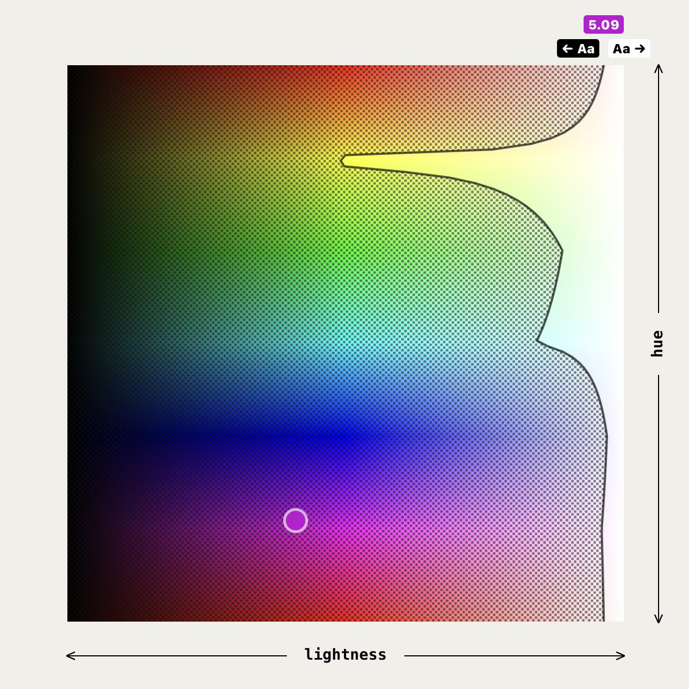
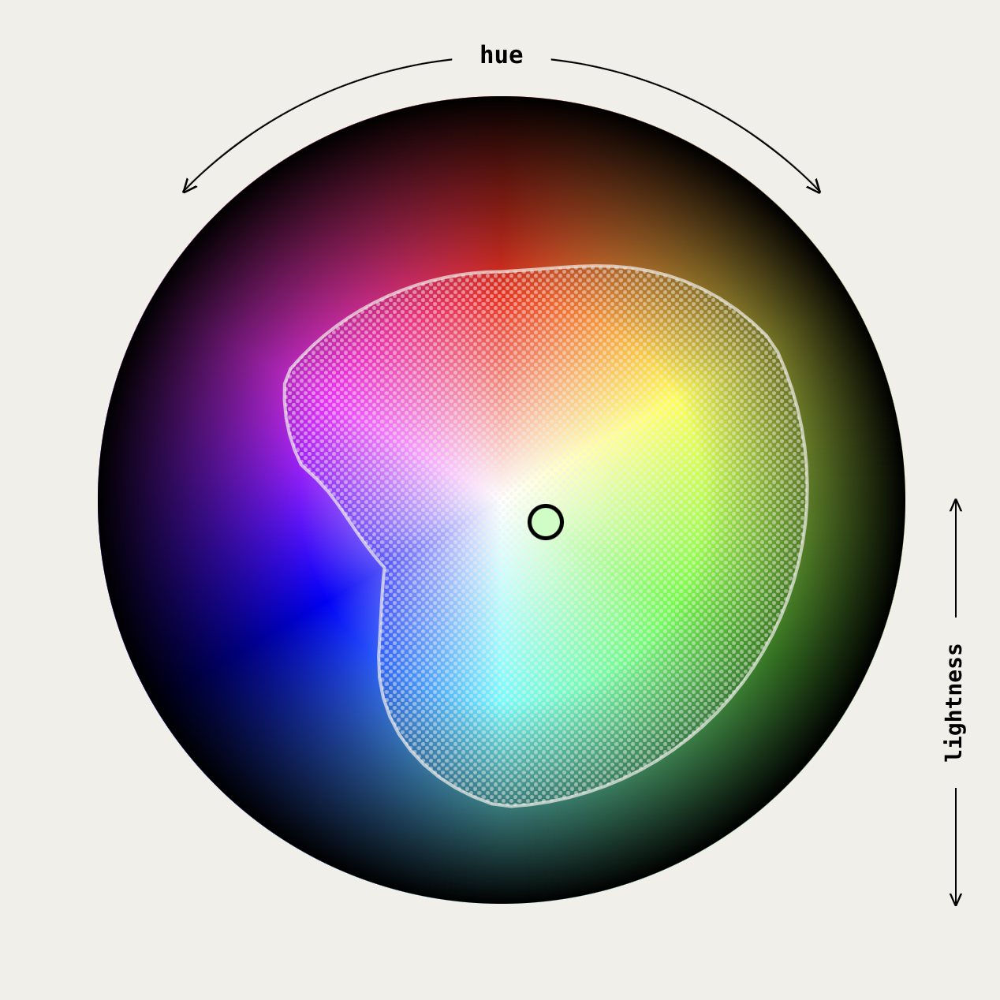

# color-contrast

a small experiment around visualizing relative luminance contrast within sRGB colorspace.

https://twitter.com/hturan/status/1512551815153434632

---

the general approach here is an iterative method to determine a lightness value resulting in a relative luminance contrast ratio equalling 4.5 given a hue, a saturation, and an HSL color.

solving this alows us to plot a boundary across hue/lightness space, showing the available values with adequate relative luminance contrast given any color.

---

spun up from `create-react-app`, so —

- clone repo
- npm i
- npm run start

to get this up and running locally.

---

lots of performance gains to be had in the react render and event handlers.

sorry that this isn't packaged up nicely, but feel free to use the methods in `utils` to do as you please.
